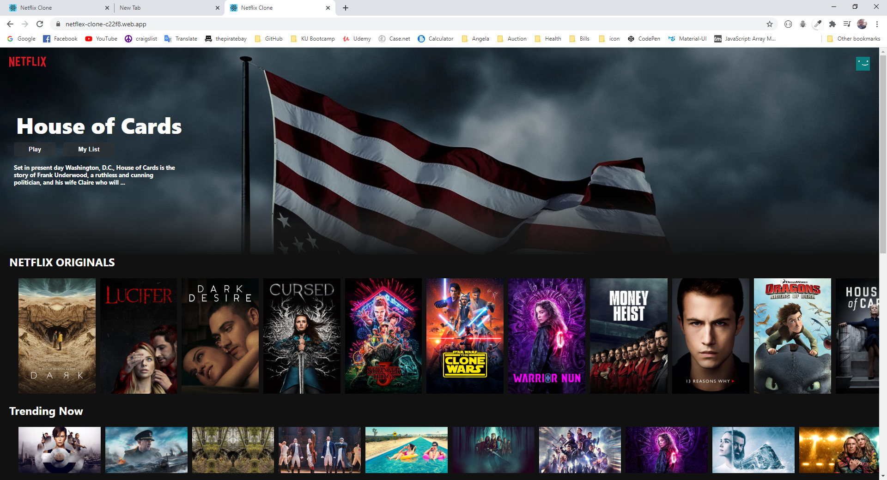

<h1>Netflix Clone app</h1>

<h2>What is it?</h2>
A Netflix app created with React used API & AXIOS

<h2>Built With</h2>
<ul>
  <li>React</li>
  <li>Yarn</li>
  <li>CSS</li>
  <li>API</li>
  <li>Firebase</li>
</ul>

<h2>Check it out!</h2>
https://netflex-clone-c22f8.web.app/
